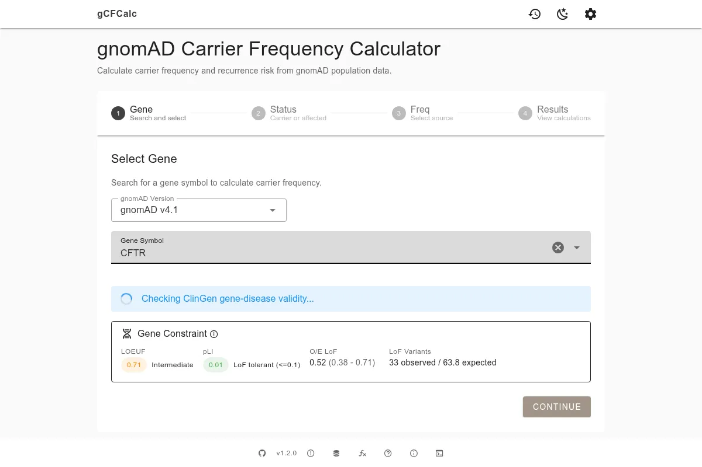

# gnomAD Carrier Frequency Calculator


[](https://gnomad-carrier-frequency.kidney-genetics.org/)
[](https://gnomad-carrier-frequency.kidney-genetics.org/docs/)

Calculate carrier frequencies for autosomal recessive conditions using gnomAD population data.

> **For Research Use Only** -- This tool is intended for research and educational purposes. It is not a validated clinical diagnostic tool. Outputs must be independently reviewed and verified by qualified professionals before any clinical use.

<a href="https://gnomad-carrier-frequency.kidney-genetics.org/">
  
</a>

## Features

- **Direct gnomAD Queries** - Queries gnomAD GraphQL API directly from the browser
- **Population-Specific Frequencies** - Calculate carrier frequencies for multiple populations
- **Configurable Filters** - Toggle LoF HC, missense, and ClinVar pathogenicity filters
- **Variant Details** - View contributing variants with HGVS nomenclature and allele frequencies
- **ClinGen Validation** - Automatic gene-disease validity checking against ClinGen curations
- **Gene Constraint Scores** - Display pLI and LOEUF constraint metrics
- **Text Generation** - Generate German and English documentation text from customizable templates
- **Dark/Light Theme** - Automatic theme detection with manual override

## Quick Start

Requires [Node.js](https://nodejs.org/) 18+ or [Bun](https://bun.sh/).

```bash
# Clone the repository
git clone https://github.com/berntpopp/gnomad-carrier-frequency.git
cd gnomad-carrier-frequency

# Install dependencies
bun install
# or: npm install

# Start development server
bun run dev
# or: npm run dev
```

The app opens at `http://localhost:5173/gnomad-carrier-frequency/`

For full documentation, visit [gnomad-carrier-frequency.kidney-genetics.org/docs](https://gnomad-carrier-frequency.kidney-genetics.org/docs/).

## License & Citation

This project is licensed under the [MIT License](LICENSE).

To cite this tool, see the [Citation page](https://gnomad-carrier-frequency.kidney-genetics.org/docs/about/citation).
